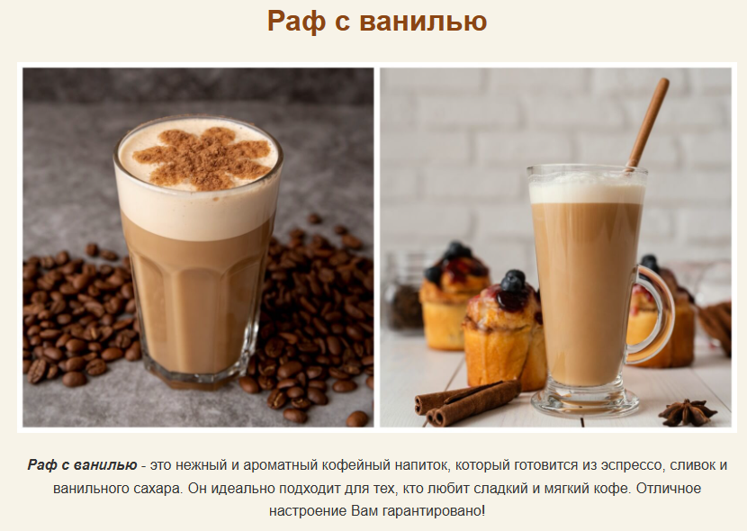

# first-project

Этот репозиторий содержит файлы из моего второго Домашнего задания, а также простую веб-страницу про "Раф с ванилью".

## Моя первая веб-страница "Раф с ванилью"
http://127.0.0.1:5500/index.html

### Скриншот

### Технологии
Вёрстка страницы с помощью HTML, создание стилей для элементов с помощью CSS.
* В HTML я создала структуру страницы, добавила заголовок, описание и изображение.
* С помощью CSS я задала цвета, шрифты и расположение элементов на странице.
  
